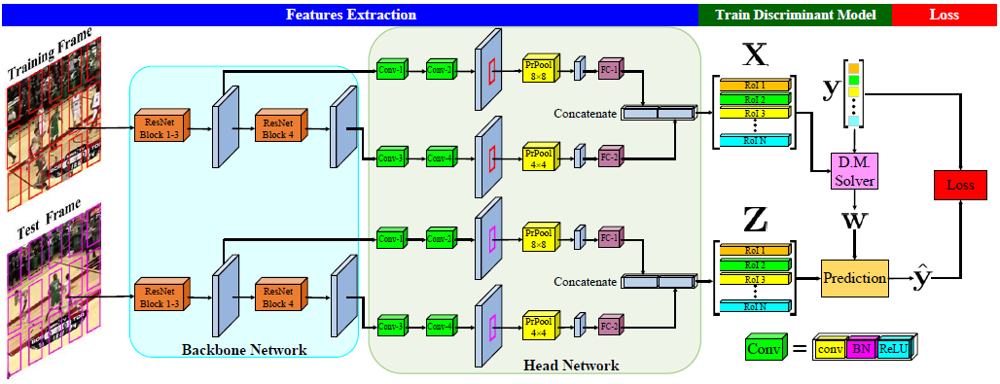

# DCFST
Learning Feature Embeddings for Discriminant Model based Tracking (Accepted by ECCV2020):

## Abstract
After observing that the features used in most online discriminatively trained trackers are not optimal, in this paper, we propose a novel and effective architecture to learn optimal feature embeddings for online discriminative tracking. Our method, called DCFST, integrates the solver of a discriminant model that is differentiable and has a closed-form solution into convolutional neural networks. Then, the resulting network can be trained in an end-to-end way, obtaining optimal feature embeddings for the discriminant model-based tracker. As an instance, we apply the popular ridge regression model in this work to demonstrate the power of DCFST. Extensive experiments on six public benchmarks, OTB2015, NFS, GOT10k, TrackingNet, VOT2018, and VOT2019, show that our approach is efficient and generalizes well to class-agnostic target objects in online tracking, thus achieves state-of-the-art accuracy, while running beyond the real-time speed.

## Tracking performance
DCFST is a simple yet effective tracker. This project provides the training and test codes of DCFST. It can reproduce the accuracy on the following six popular tracking benchmarks reported in the paper. Note that, DCFST-18 and DCFST-50 are DCFST with ResNet-18 and DCFST-50 backbone, respectively.

### Results on Popular challenging benchmarks
| Dataset    |  OTB2015 |  NfS  | TrackingNet | GOT10k |
|------------|----------|-------|-------------|--------|
|DCFST-18    |   70.9%  | 63.4% |    73.9%    |  61.0% |
|DCFST-50    |     -    | 64.1% |    75.2%    |  63.8% |

### Results on VOT benchmarks
| Dataset    |  VOT2018 | VOT2019 | VOT2019 Real-Time |
|------------|----------|---------|-------------------|
|DCFST-18    |   41.6%  |  36.1%  |       31.7%       |
|DCFST-50    |   45.2%  |    -    |         -         |
